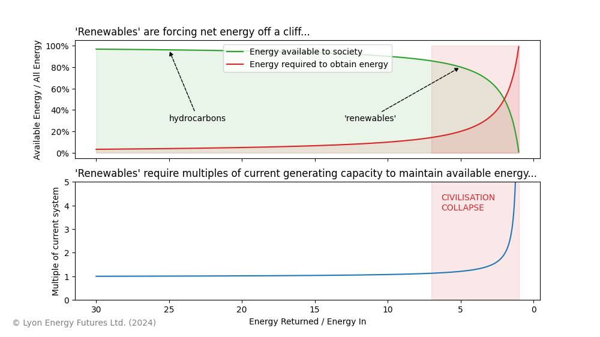

# The Energy Cliff

It takes energy to get energy. For every hundred units of energy we produce, some fraction of it must be retained to
produce the next hundred units. The amount we retain is called the Energy Return on Energy Invested (EROI).

The attempt to substitute affordable, dense sources of energy such as hydrocarbon and nuclear
with unaffordable sources such as wind and solar is causing a catastrophic drop in EROI. As it falls, we have to
build a larger and larger energy system to produce the same amount of energy. This is the Energy Cliff.

This script plots the size of the required energy system in multiples of our current energy system as "renewables"
degrade its EROI.

